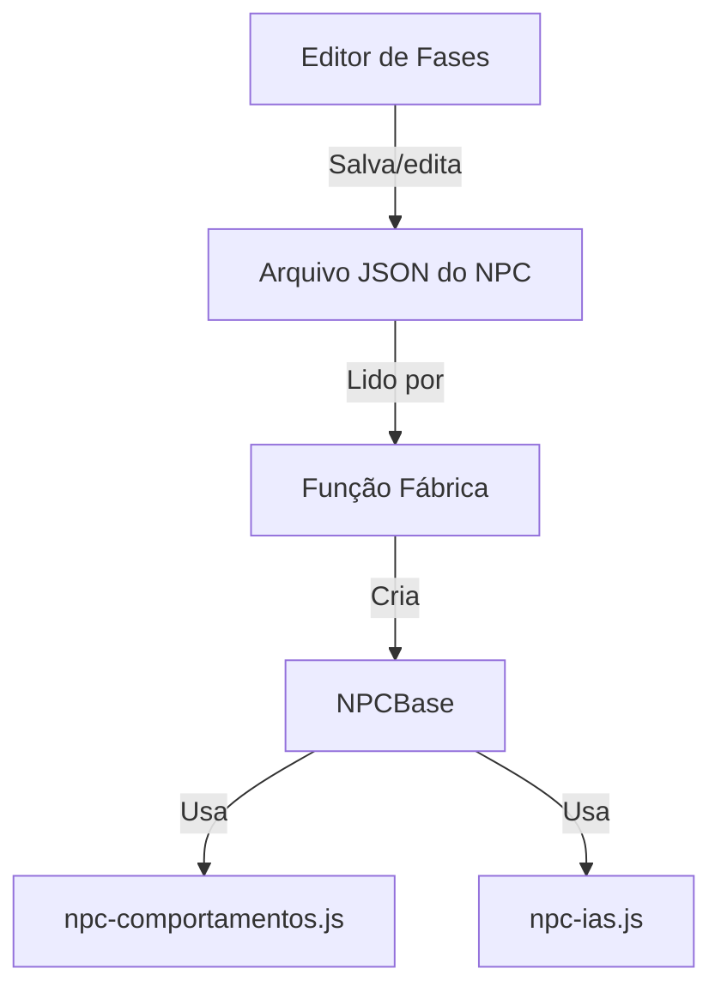

# Sistema de NPCs — Guia de Criação, Reuso e Integração com Editor de Fases

## Visão Geral
Este sistema permite criar, configurar e manter NPCs (inimigos, aliados, etc.) de forma modular e reutilizável. Toda a lógica base, comportamentos e IA são separados em módulos, e os dados dos NPCs ficam em arquivos JSON, facilitando integração com o editor de fases.

---

## Estrutura dos Arquivos

- `src/core/npc-base.js`: Classe base genérica de NPC.
- `src/core/npc-comportamentos.js`: Comportamentos reutilizáveis (andar, patrulhar, fugir, etc).
- `src/core/npc-ias.js`: IAs reutilizáveis (agressivo, passivo, etc).
- `src/core/npc-factory.js`: Função fábrica que monta NPCs a partir de JSON.
- `config/npc-exemplo.json`: Exemplo de configuração de NPC.

---

## Como Criar um Novo NPC

1. **Crie um arquivo JSON em `config/` ou `config/inimigos/`**

Exemplo:
```json
{
  "nome": "robô patrulha",
  "vida": 15,
  "dano": 2,
  "sprite": "inimigo_bb/robo.png",
  "ia": "agressivo",
  "comportamentos": ["patrulha"],
  "drops": ["bateria"]
}
```

2. **(Opcional) Adicione novos comportamentos ou IAs**
- Implemente em `npc-comportamentos.js` ou `npc-ias.js`.
- Exemplo de comportamento:
```js
// npc-comportamentos.js
module.exports.novoComportamento = function(npc, dt) {
  // lógica...
};
```

3. **Carregue o NPC no jogo**
- Use a função fábrica:
```js
const criarNPC = require("./npc-factory");
const config = require("../../config/npc-exemplo.json");
const npc = criarNPC(config);
```

---

## Integração com o Editor de Fases

1. **No JSON da fase, adicione os NPCs**

Exemplo de trecho em `config/fases/index.json`:
```json
{
  "npcs": [
    {
      "tipo": "robô patrulha",
      "x": 100,
      "y": 200,
      "config": "config/npc-robo.json"
    }
  ]
}
```

2. **No carregamento da fase:**
- Para cada NPC listado, carregue o JSON de config e use a fábrica:
```js
const criarNPC = require("src/core/npc-factory");
const npcConfig = require("config/npc-robo.json");
const npc = criarNPC({ ...npcConfig, x: npcData.x, y: npcData.y });
```

3. **O editor pode permitir editar todos os campos do JSON** (vida, dano, IA, comportamentos, drops, sprite, posição, etc).

---

## Como Adicionar Novos Comportamentos ou IAs

- Basta criar uma função em `npc-comportamentos.js` ou `npc-ias.js` e referenciar pelo nome no JSON do NPC.
- Exemplo:
```js
// npc-ias.js
module.exports.sniper = function(npc, dt) {
  // lógica de IA sniper
};
```
```json
{
  "ia": "sniper"
}
```

---

## Dicas de Manutenção
- Separe bem comportamentos e IAs para facilitar reuso.
- Use nomes claros nos JSONs.
- Documente comportamentos/IAs novos no próprio arquivo.
- Teste NPCs individualmente antes de colocar em fases.

---

## Resumo Visual


---

## Exemplos Rápidos

- **Adicionar NPC novo:**
  - Crie JSON, adicione no editor de fases, pronto!
- **Novo comportamento:**
  - Implemente função, referencie no JSON.
- **Novo tipo de IA:**
  - Implemente função, referencie no JSON.

---

Dúvidas? Consulte este arquivo ou peça exemplos práticos!
